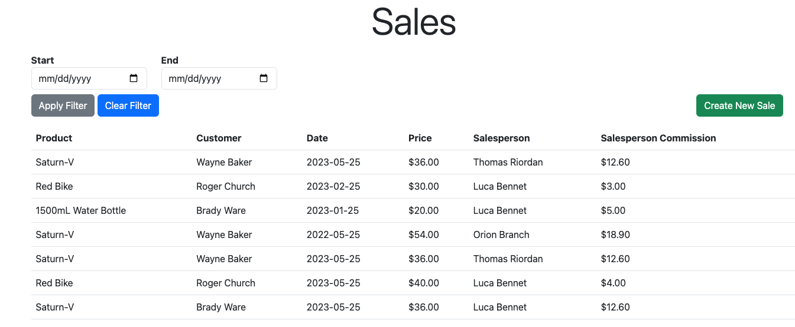

# BeSpoked-Bikes-Sales



A simple CRUD app meant to simulate running a bike company with sales, customers, purchases, and other management system. Made for the 48 hour technical challenge for Profisee. 

## Local Installation 
This is a [python 3.10](https://www.python.org/downloads/release/python-3100/) project that uses [ poetry ]( https://python-poetry.org/ ) as it's package manager. To get started, make sure you have python 3.10.11 and poetry installed on your local device and clone the repository from github to your device. 

Navigate to the directory of the repository:
```shell
cd BeSpoked-Bikes-Sales
```
And run
```shell
poetry install
```
To install all of the required dependencies. 

To run the server on your local machine in debug mode (for hot reloading), enter this command:
```shell
poetry run flask --app bespoked_bikes_sales run --debug
```

If you ever want to recreate the database (using the seeding data provided in `bespoked_bikes_sales/db_setup.py`), delete `instance/sales.db` and run the `db_setup.py` script:
```shell
poetry run bespoked_bikes_sales/db_setup.py
```

## Why Python, and Flask?
[Flask](https://flask.palletsprojects.com/en/2.3.x/) is a web microframework written in python that allows you make quick and simple server backends. I chose python and flask because given the time period (48 hours) a dynamic and ergonomic language like python allows me to write code and debug it quickly, especially since I have more experience debugging dynamic languages. Flask also has many extensions to integrate with other packages, so I used it in combination with [SQLAlchemy](https://www.sqlalchemy.org/) to use language integrated query to interact with my SQLite database and with [WTForms](https://wtforms.readthedocs.io/en/3.0.x/) to generate forms and validate data on the server. 

## How does it work?
As simple as a CRUD web app can get: flask routes on the backend serving templates using the [jinja templating language](https://jinja.palletsprojects.com/en/3.1.x/) to dynamically generate the html. There is no javascript or any other logic on the frontend, as it is not needed. All there is are forms to `POST` data to the server, and routes to `GET` html. 
